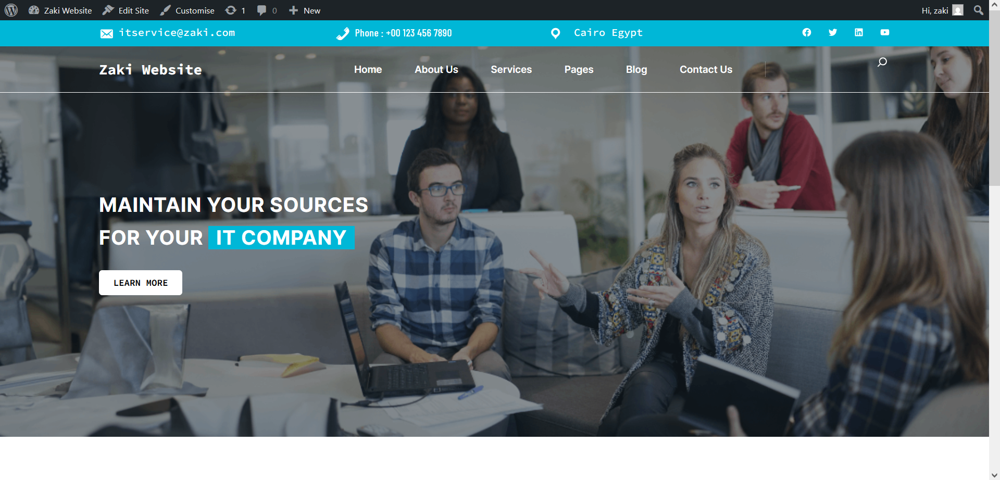

# 🚀 LAMP Stack with WordPress on CentOS 

This project documents the **installation of a LAMP stack and WordPress** on CentOS.

## 📋 Overview

* **OS:** CentOS 8
* **Web Server:** Apache
* **Database:** MariaDB
* **Language:** PHP
* **CMS:** WordPress


## 📚 Installation Steps

### Step 1: Download WordPress
```bash
wget https://wordpress.org/latest.zip

yum install zip

unzip latest.zip && yum install zip && unzip latest.zip
```

### Step 2: Install PHP & Required Modules
```bash
yum install php

yum install php-mysqlnd.x86_64

yum install php-json
```

### Step 3: Configure Apache for PHP
```bash
vim /etc/httpd/conf.d/php.conf
```
Modify PHP module settings as needed.


### Step 4: Create WordPress Database & User

Log in to MariaDB:
```bash
mysql -u root -p
```
Inside MariaDB:
```bash
show databases;

grant all on wordpressdb.\* TO 'wordpressuser'@'localhost' IDENTIFIED BY 'wordpresspassword';

flush privileges;

exit;
```

### Step 5: Configure wp-config.php

Edit the `wp-config.php` file:
```bash
define('DB\_NAME', 'wordpressdb');

define('DB\_USER', 'wordpressuser');

define('DB\_PASSWORD', 'wordpresspassword');

define('DB\_HOST', 'localhost');
```

### Step 6: Access the WordPress Site

In the browser, go to:

* [http://your-server-ip/](http://your-server-ip/)

Fill in the WordPress setup form to complete the installation.


## 📷 Wordpress Website




## 🧾 Notes

* Apache must be running:
  ```bash
  systemctl start httpd
  ```
* MariaDB must be running:
  ```bash
  systemctl start mariadb
  ```
* If SELinux or firewalld blocks access, adjust them accordingly.

* Copy WordPress files to:
  ```bash
  cp -r wordpress/\* /var/www/html/
  
  chown -R apache\:apache /var/www/html
    ```
  
## ✅ Status

Successfully set up a LAMP stack and deployed WordPress on CentOS.


